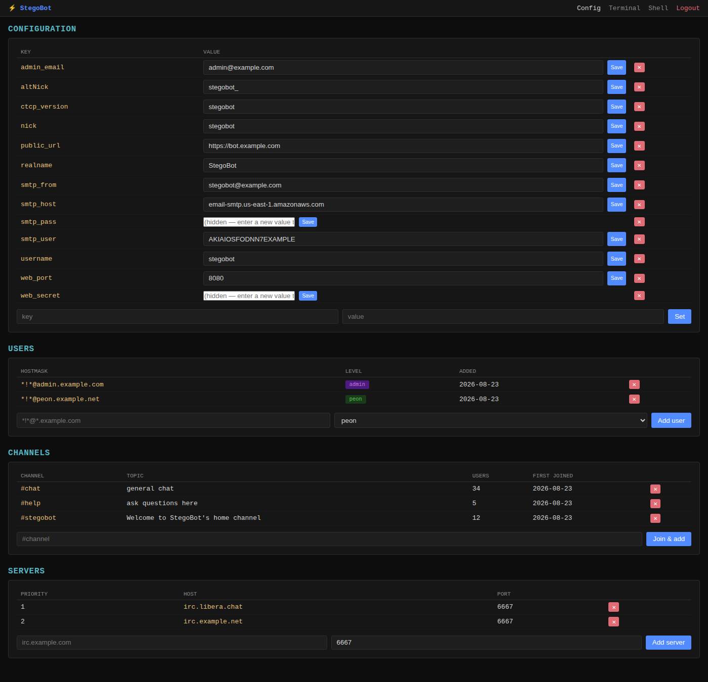
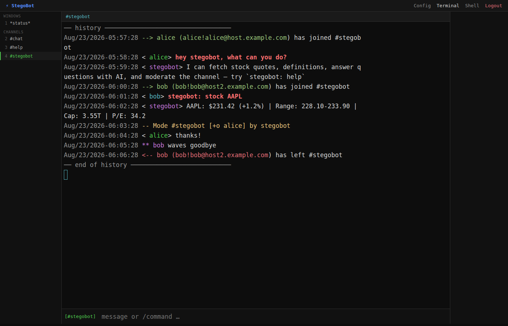
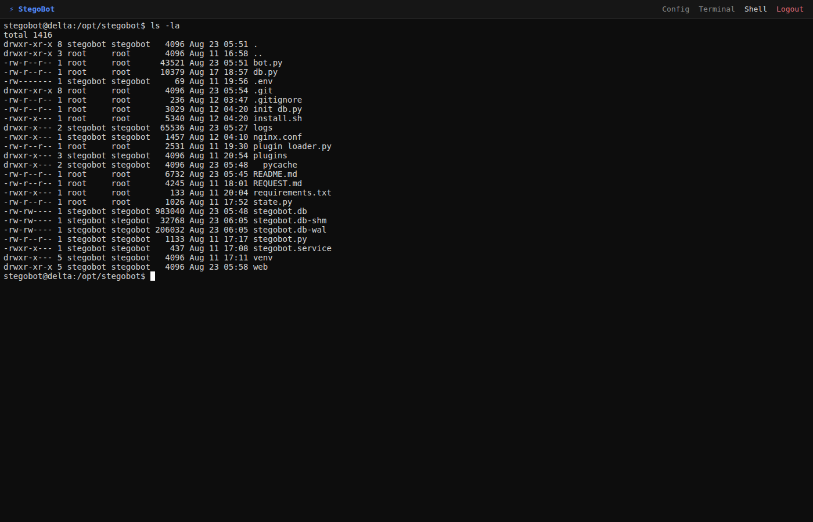

# StegoBot

Python IRC bot with a Flask/xterm.js web UI. Runs as a systemd service (`stegobot.service`). Web UI on port 8080.

---

## IRC Commands

Commands are addressed to the bot in a channel (`botnick: cmd`) or sent as a private message (`/msg botnick cmd`).

### Public commands (no auth required)

| Command | Example | Description |
|---|---|---|
| `prompt <text>` | `<bot nickname>: prompt what is tcp/ip?` | Ask Gemini AI a question, requires gemini API key in .env |
| `ai <text>` | `<bot nickname>: ai explain tcp/ip` | Alias for `prompt` |
| `channelprompt <text>` | `<bot nickname>: channelprompt summarize the last 24h` | Ask Gemini about this channel's logs (feeds up to 2 MB of log history as context) |
| `stock <ticker>` | `<bot nickname>: stock AAPL` | Stock quote — price, change, range, cap, P/E, earnings, dividend |
| `quote <ticker>` | `<bot nickname>: quote TSLA` | Alias for `stock` |
| `urbandictionary <word>` | `<bot nickname>: urbandictionary rizz` | Urban Dictionary top definition |
| `ud <word>` | `<bot nickname>: ud rizz` | Alias for `urbandictionary` |
| `define <word>` | `<bot nickname>: define serendipity` | Dictionary definition (dictionaryapi.dev, up to 3 defs) |
| `def <word>` | `<bot nickname>: def serendipity` | Alias for `define` |

### Peon + Admin commands

| Command | Example | Description |
|---|---|---|
| `op me` | `<bot nickname>: op me` | Bot gives you `+o` in the current channel |
| `join <channel>` | `<bot nickname>: join #chat` | Bot joins a channel and saves it to DB |
| `leave` | `<bot nickname>: leave` | Bot parts the current channel and removes it from DB |
| `banword <phrase>` | `<bot nickname>: banword "gm slur"` | Ban a word/phrase in the channel — any message containing it (case-insensitive) is auto-banned+kicked. From PM: `banword #channel <phrase>` |
| `delbanword <phrase>` | `<bot nickname>: delbanword "gm slur"` | Remove a banned word/phrase. From PM: `delbanword #channel <phrase>` |
| `banwords` | `<bot nickname>: banwords` | List banned words/phrases for the channel. From PM: `banwords #channel` |
| `permban <mask>` | `<bot nickname>: permban *!*@some.host` | Ban a hostmask in the channel; also immediately kicks/bans any current member matching it. From PM: `permban #channel <mask>` |
| `unban <mask>` | `<bot nickname>: unban *!*@some.host` | Remove a permban and lift the `+b`. From PM: `unban #channel <mask>` |
| `permbans` | `<bot nickname>: permbans` | List permban masks for the channel. From PM: `permbans #channel` |

### Admin-only commands

| Command | Example | Description |
|---|---|---|
| `adduser <nick> <level>` | `<bot nickname>: adduser john peon` | WHOISes nick and adds their hostmask to the user DB (levels: `peon`, `admin`) |
| `nick <newnick>` | `<bot nickname>: nick newname` | Change the bot's nick and save to config |
| `query <sql>` | `<bot nickname>: query SELECT * FROM users` | Run a raw SQL query against the bot's SQLite DB (results in IRC, 10 row cap) |
| `server <host> [port]` | `<bot nickname>: server irc.libera.chat 6667` | Reconnect to a different IRC server |
| `addserver <host> [port]` | `<bot nickname>: addserver irc.libera.chat` | Add a server to the DB server list |
| `delserver <host>` | `<bot nickname>: delserver irc.libera.chat` | Remove a server from the DB server list |

---

## Web UI Pages

| Page | Description |
|---|---|
| `/config` | Edit bot config (key/value settings, with inline edit or delete), users, channels, servers, permbans, and line-count auto-replies |
| `/terminal` | irssi-style IRC client in the browser — channel list, message pane, user list, slash commands |
| `/shell` | A real shell on the host the bot runs on, in your browser |

Login is a single-admin magic-link flow (email set via `admin_email` in config). Once logged in, the nav bar at the top (Config / Terminal / Shell / Logout) is how you get to each page below — nothing here happens on its own, you click the page you want.

**Config** — click **Config** in the nav to edit settings, users, channels, and servers; values can be edited in place (not just deleted):



**Terminal** — click **Terminal** in the nav for an irssi-style IRC client in the browser:



**Shell** — click **Shell** in the nav for a real shell on the host, running `ls -la`:



### Shell

Clicking **Shell** in the nav starts a `bash` session on the machine running the bot, as the same OS user the bot process runs as (not root) — functionally the same as SSHing into the box as that account, except it doesn't go through SSH or require that account to have login/password access (the bot's user is typically locked out of interactive login via `/usr/sbin/nologin`; the web shell bypasses that the same way `su` would, by exec'ing straight from the already-running process). There's no sandboxing beyond normal OS file permissions for that user — treat `/shell` access as equivalent to giving someone a login shell on the server, and keep `admin_email` locked down accordingly.

---

## Web UI Slash Commands

Typed in the terminal input (prefix with `/`). Always operate on the currently active channel unless a target is specified.

| Command | Example | Description |
|---|---|---|
| `/join <channel>` | `/join #chat` | Join a channel |
| `/part [channel]` | `/part` | Part the current channel |
| `/leave [channel]` | `/leave #chat` | Alias for `/part` |
| `/nick <newnick>` | `/nick newname` | Change nick |
| `/msg <target> <text>` | `/msg john hey` | Send a private message |
| `/me <text>` | `/me waves` | Send a CTCP ACTION in current channel |
| `/quit [message]` | `/quit later` | Disconnect from IRC |
| `/kick <nick> [reason]` | `/kick john spam` | Kick nick from current channel |
| `/ban <nick>` | `/ban john` | Ban nick's host from current channel (`*!*@host`) |
| `/unban <mask>` | `/unban *!*@host` | Remove a ban |
| `/op <nick>` | `/op john` | Give `+o` to nick |
| `/deop <nick>` | `/deop john` | Remove `+o` from nick |
| `/voice <nick>` | `/voice john` | Give `+v` to nick |
| `/devoice <nick>` | `/devoice john` | Remove `+v` from nick |
| `/topic <text>` | `/topic welcome to #chat` | Set channel topic |
| `/whois <nick>` | `/whois john` | WHOIS a nick (result shown in channel) |
| `/mode <mode> [arg]` | `/mode +m` | Set a channel mode |
| `/raw <line>` | `/raw PRIVMSG #chan :hi` | Send a raw IRC line |
| `/<anything else>` | `/stats p` | Unknown slash commands are sent as raw IRC |

**Line-count auto-replies** — in `/config`, register a hostmask pattern (`nick!ident@host`, `*` wildcards allowed) plus one or more channels. Once a matching user has sent that many lines in a matching channel, the bot sends one message there — picked at random if more than one is stored — and starts counting again. Trigger amount can be a fixed number of lines, or "random, up to a max" (a fresh random threshold between 1 and the max is rolled each cycle). Counting is tracked separately per channel and per concrete hostmask, so a wildcard pattern tracks each matching user independently.

---

## Plugins

Drop a `.py` file into `plugins/` and it hot-reloads on next command — no restart needed.

### Plugin contract

```python
COMMANDS = ['cmd1', 'cmd2']   # command names (lowercase)
PUBLIC   = True               # if True, works without auth; False = peon+ only

def handle(cmd, args, ctx):
    # ctx keys: nick, channel, public, level, reply (callable), conn
    ctx['reply']('hello')
    return True               # return True = handled; None/False = skip
```

---

## Logs

Channel logs: `/opt/stegobot/logs/{channel}_{date}.log`
Compressed on midnight rollover: `{channel}_{date}.log.gz`

View live: `journalctl -u stegobot -f`

---

## Service management

```bash
systemctl status stegobot
systemctl restart stegobot
systemctl stop stegobot
journalctl -u stegobot -n 100
```
